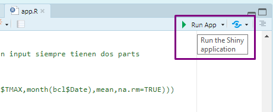
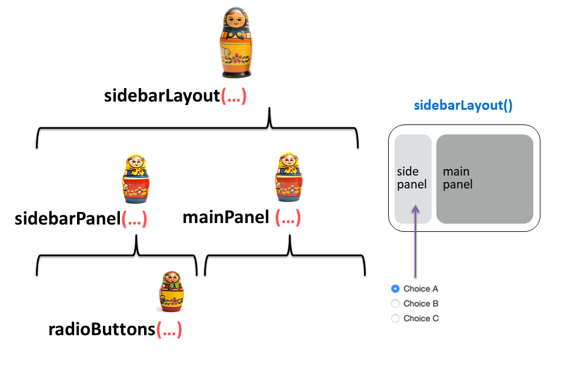
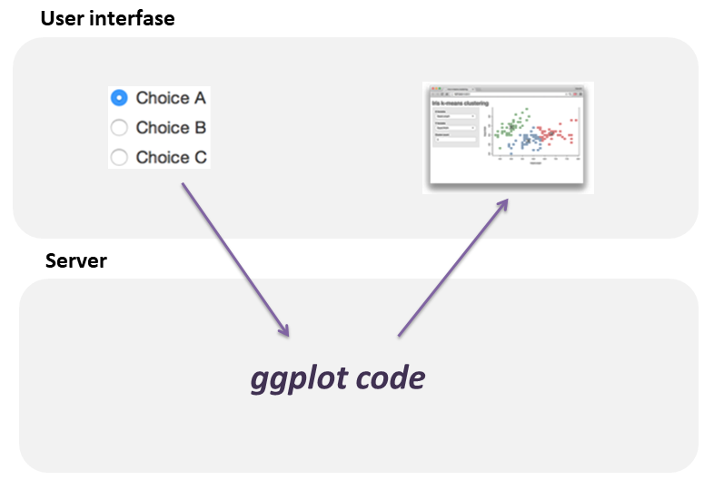
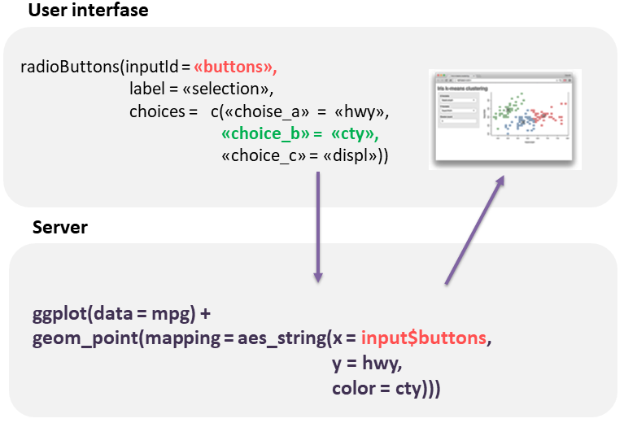
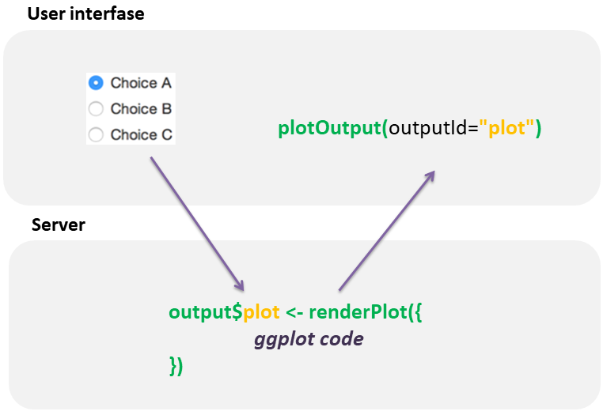
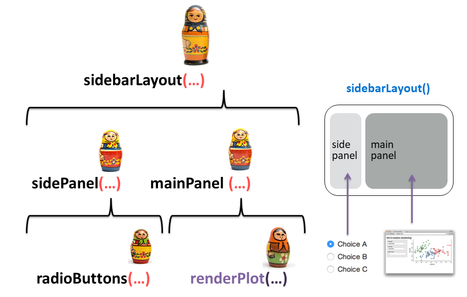

```{r setup, include=FALSE}
options(htmltools.dir.version = FALSE)
```

class: center, middle

# Licence

<a rel="license" href="http://creativecommons.org/licenses/by-sa/4.0/"></a><br />This work is licensed under a <a rel="license" href="http://creativecommons.org/licenses/by-sa/4.0/">Creative Commons Attribution-ShareAlike 4.0 International License</a>.

---

class: center, inverse, bottom
background-image: url("Shiny_grande.jpg")
background-position: 50% 50%

## Interactive Webapps in R

---

# Basics

A Shiny app is a web page (UI) connected to a computer running a live R session (Server)

```{r init, echo=FALSE, fig.align="center", out.width='50%'}
knitr::include_graphics("cheat1.png")
```

--

Users can manipulate the UI, which will cause the server to update the UI’s displays (by running R code).

.footnote[Source: Shiny RStudio Cheatsheet.]

---

# App.R 📄


```{r eval=FALSE, tidy=FALSE}

library(shiny)

# User interfase
UI <- fluidPage( ) 

# Server
Server <- function(input, output){      }

# Combines UI and server
shinyApp (ui = ui, server = server)

```

You can insert all the code at once with the shinyapp snippet

```{r init2, echo=FALSE, fig.align="center", out.width='25%'}
knitr::include_graphics("snippet_2.png")
```

---

# Building a shiny app

```{r shiny, echo=FALSE, fig.align="center", out.width='50%'}
knitr::include_graphics("cheat1.png")
```

.pull-left[

**UI**

1. Add the template -> ***app.R*** 

1. Select a layout function 

1. Select Inputs and place them

]

.pull-right[

**Server**

1. Select `render*()` and `*Output()` functions 

1. Refer to outputs with `output$<id>`

1. Refer to inputs with `input$<id>`

]

---

# Run the app 🎬

* Click the Run App button in the document toolbar.


```{r run, echo=FALSE, fig.align="center", out.width='25%'}

```


* Use a keyboard shortcut: Cmd/Ctrl + Shift + Enter.

* `shiny::runApp()` with the path to the directory containing **app.R**

.footnote[Source: https://mastering-shiny.org/basic-app.html]

---

# Cheatsheet


```{r rstudio_cheat, echo=FALSE, fig.align="center", out.width='80%'}
knitr::include_graphics("cheatsheet.png")
```

.footnote[Source: https://shiny.rstudio.com/articles/cheatsheet.html]


---

class: center, middle

# User Interfase (UI)

```{r mamus, echo=FALSE, fig.align="center", out.width='90%'}
knitr::include_graphics("mamu_4.jpg")
```

---

# Layout

Organize panels and elements into a layout with a
**layout function**

```{r init3, echo=FALSE, fig.align="center", out.width='90%'}
knitr::include_graphics("layout.png")
```

.footnote[Source: Shiny RStudio Cheatsheet.]

---

class: center, middle

```{r init5, echo=FALSE, fig.align="center", out.width='100%'}
knitr::include_graphics("slide_mamu1.png")
```

`Ui <- fluidPage(sidebarLayout(sidebarPanel(…), mainPanel(…))`

---

# Inputs

Collect values from the user

```{r init4, echo=FALSE, fig.align="center", out.width='100%'}
knitr::include_graphics("inputs.png")
```

.footnote[Source: Shiny RStudio Cheatsheet.]
---

class: center, middle

```{r radiobut, echo=FALSE, fig.align="center", out.width='90%'}

```

`Ui <- fluidPage(sidebarLayout(sidebarPanel(radioButtons(…)), mainPanel(…))`

---
# Input selection

`radioButtons()` arguments

```{r eval=FALSE, tidy=FALSE}

radioButtons(inputId = `"Vx"`, 
             label = `"X"`, 
             choices = c("Highway fuel economy (mpg)" = "hwy",
                         "Engine displacement (L)" = "displ",
                         "Car type" = "class"))


```

---

class: center, middle

```{r init7, echo=FALSE, fig.align="center", out.width='90%'}
knitr::include_graphics("parentesis.png")
```

---

class: center, middle

```{r adentro, echo=FALSE, fig.align="center", out.width='90%'}
knitr::include_graphics("mamu_8_sd.jpg")
```

---

class: inverse

# Live coding #1 🙌💻

* Add the Shinyapp template

* Select one layout and one input

* Run the App


➡️📁 Rladies_app

---

class: center, middle

# Reactivity


```{r title_react2, echo=FALSE, fig.align="center", out.width='100%'}
knitr::include_graphics("mamu_2.jpg")
```


---

```{r reactserv, echo=FALSE, fig.align="center", out.width='40%'}
knitr::include_graphics("server_react.png")
```
.pull-left[

**UI**

1. Add the template -> ***app.R*** 

1. Select a layout function 

1. Select Inputs and place them

]

.pull-right[

**Reactivity**

1. Select `render*()` and `*Output()` functions

1. Refer to outputs with `output$<id>`

1. Refer to inputs with `input$<id>`

]

---

# `render*()` and `*Output()` functions 


```{r out, echo=FALSE, fig.align="center", out.width='90%'}
knitr::include_graphics("outputs.png")
```

---

# Plot

```{r plot1, echo=TRUE, fig.align="center", out.width='50%', tidy=FALSE}
library(ggplot2)

ggplot(data = mpg)+
  geom_point(mapping = aes(x = displ,
                           y = hwy,
                           color = class))
```

---

# Refer to inputs with `input$<id>`

```{r react, echo=FALSE, fig.align="center", out.width='90%'}

```

---
# Refer to inputs with ```input$<id>```

```{r react2, echo=FALSE, fig.align="center", out.width='90%'}

```

---

# Refer to outputs with `output$<id>`

```{r react3, echo=FALSE, fig.align="center", out.width='90%'}

```
---

# Refer to outputs with `output$<id>`

Observe `render*()` and `*Output()` functions!

```{r react4, echo=FALSE, fig.align="center", out.width='90%'}

```

---


```{r mamu3, echo=FALSE, fig.align="center", out.width='90%'}

```


---

class: inverse, center, middle

# Extras


```{r title_extras, echo=FALSE, fig.align="center", out.width='90%'}
knitr::include_graphics("mamu_1.jpg")
```


---

# Add a Theme

```{r theme, echo=FALSE, fig.align="center", out.width='50%'}
knitr::include_graphics("shinythemes.png")
```

---

# Add a Title

```{r eval=FALSE, tidy=FALSE}
ui<- fluidPage(theme = shinytheme("lumen"), #<<
               h1(strong("R-Ladies Buenos Aires")), #<<
               h4(em("Shiny meetup")), #<<
     sidebarLayout( sidebarPanel( radioButtons(…) ),
                                  mainPanel(… ))

```

---

# Format

```{r header, echo=FALSE, fig.align="center", out.width='50%'}
knitr::include_graphics("header.png")
```

.footnote[Source: Shiny RStudio Cheatsheet.]
---

# Include an image

1. Place the file in the ***www*** subdirectory
1. Link to it with  `img(src="<file name>")`


```{r hola, echo=FALSE, fig.align="center", out.width='90%'}
knitr::include_graphics("structure.png")
```

`img(src='rladies.png', width = 200)`

---

class: inverse

# Live coding #2 🙌💻

* Server

* Reactivity

* Run the app


➡️📁 Rladies_app

---

class: inverse, center, middle
# Repo


https://github.com/flor14/rladies_shiny_meetup

---

class: inverse, center, middle

# Examples
 
 [Genoma](https://www.youtube.com/watch?v=5KByRC6eqC8) 

[Tutorial R-Studio](https://shiny.rstudio.com/tutorial)

https://blog.weplaydots.com/post/128921045964


---

class: inverse, center, middle

# Links
 
- [Mastering Shiny](https://mastering-shiny.org/)
 
- [Shiny's Holy Grail - UseR! 2019 - Joe Cheng  video](https://www.youtube.com/watch?v=5KByRC6eqC8) 

- [Tutorial R-Studio](https://shiny.rstudio.com/tutorial)


---

class: inverse, center, middle

# R-Ladies Buenos Aires

<a href="mailto:buenosaires@rladies.org"><i class="fa fa-envelope"></i>&nbsp; buenosaires@rladies.org</a>

<a href="https://www.meetup.com/es-ES/rladies-buenos-aires/"><i class="fa fa-meetup"></i>&nbsp; rladies-buenos-aires</a>

<a href="https://www.facebook.com/RladiesBA"><i class="fa fa-facebook-official"></i>&nbsp; RladiesBA </a>

<a href="http://twitter.com/rladiesBA"><i class="fa fa-twitter fa-fw"></i>&nbsp; @rladiesBA</a>

<a href="https://www.instagram.com/rladiesba/"><i class="fa fa-instagram"></i>&nbsp; rladiesba</a>

<a href="https://github.com/rladies/meetup-presentations_buenosaires"><i class="fa fa-github fa-fw"></i>&nbsp; @meetup-presentations_buenosaires</a>


---

class: center, middle

# Thanks!


Slides created via the R package [**xaringan**](https://github.com/yihui/xaringan).

The Template comes from [Allison Horst](https://remarkjs.com)

